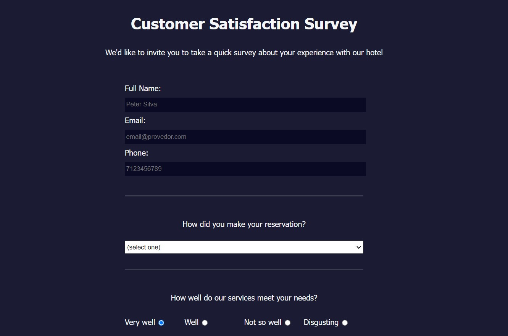

# Customer Satisfaction Survey Form

This project is a responsive customer satisfaction survey form designed using HTML and CSS. It showcases a simple survey form where users can provide feedback about their experience with a hotel. The code for this project was created based on the studies from the "Responsive Web Design" course on [Free Code Camp](https://www.freecodecamp.org/).

## Preview

## Features

- Responsive design that adapts to different screen sizes
- User-friendly input fields, radio buttons, checkboxes, and a textarea
- Clear section divisions and labels for better organization
- Stylish form layout and styling

## Technologies Used

- HTML
- CSS

## Getting Started

1. Clone this repository to your local machine.
2. Open the `index.html` file in your web browser to view the customer satisfaction survey form.

## CSS Styles

The CSS styles for this project can be found in the `styles.css` file. Here are some key classes and their descriptions:

- `.form-section`: Styling for each section of the survey form.
- `.row`, `.column`: Flexbox layout for arranging elements.
- `.inline`: Inline elements styling for checkboxes and radio buttons.
- `input[type="submit"]`: Styling for the submit button.

